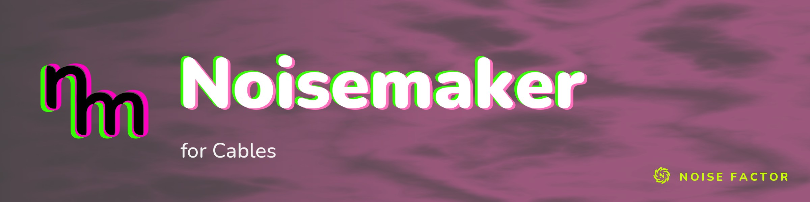

<!-- repo-hero -->

Open source from <a href="https://noisefactor.io">Noise Factor</a> &middot; <a href="https://github.com/noisefactorllc">more projects</a>

# Noisemaker for Cables

> This package supports the "Export Shader Pipeline" feature in Noisedeck.app. The
> feature runs shader compositions on other platforms. Noise Factor derives this package
> from the upstream Noisemaker Engine project and tests it for pixel-level parity.

`@noisefactor/noisemaker-for-cables` brings Noisemaker's Polymorphic shader
engine and complete effect catalog to Cables GL without a second rendering
context or CPU readback.

The first release exposes one native Cables op:
`Ops.Extension.Noisemaker.Program`. Generated per-effect ops are outside the
initial package scope.

The bundle contains the pinned reference Noisemaker compiler, engine, GLSL, and
all 210 locked effects. It accepts complete Polymorphic programs, including
multi-pass graphs, feedback, points, simulations, 3D volumes, cubemaps, UBO
remapping, and media input.

The installed op remains `Ops.Extension.Noisemaker.Program`. Its browser global
(`NoisemakerCablesGL`) and dependency filename (`lib_noisemaker-cablesgl.js`)
are retained as compatibility identifiers so existing Cables patches continue
to load unchanged.

- [Install the op in Cables Standalone](docs/installation.md)
- [Open the example patch](examples/README.md)
- [Read the runtime architecture](docs/architecture.md)
- [Update the pinned effect catalog](docs/catalog-update.md)

## License

Released under the MIT License (see [LICENSE](LICENSE)). Use of the Noisemaker
and Noise Factor names in derivative products is subject to the
[Trademark Policy](TRADEMARK.md).

Copyright © 2026 Noise Factor LLC
